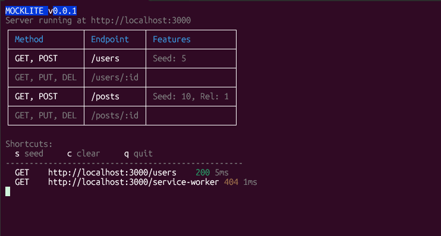

# @mocklite/cli

**Zero-Configuration, SQLite-based Mock Server for Modern Frontend Development.**

[](https://www.npmjs.com/package/@mocklite/cli)
[](https://opensource.org/licenses/MIT)

MockLite is a powerful, lightweight mock server designed to speed up frontend development. It auto-generates a full REST API based on a simple JSON schema, populates it with realistic data using [Faker.js](https://fakerjs.dev), and even simulates network conditions like slow connections or chaos modes.



## ✨ Features

- **🚀 Zero Boilerplate**: Define a generic JSON config and get a full CRUD API instantly.
- **🌱 Realistic Seeding**: Powered by Faker.js to generate thousands of realistic records.
- **🔍 Advanced Querying**: Supports filtering, pagination, and Partial Search out of the box.
- **🔗 Relational Data**: Automatically handles `BelongsTo` and `HasMany` relationships.
- **⚠️ Network Simulation**: Built-in support for artificial latency (Delay) and Chaos Mode (Random Errors).
- **💾 Local Persistence**: Uses SQLite, so your data persists between restarts (or resets if you choose).
- **🛠️ Interactive Mode**: Shortcuts to re-seed or clear data while the server runs.

---

## 🚀 Getting Started

### 1. Installation

You can run MockLite directly using `npx` or install it globally.

```bash
# Run directly (Recommended)
npx @mocklite/cli init

# Or install globally
npm install -g @mocklite/cli
```

### 2. Initialize Project

Run the initialization command in your project root. This creates a starter `mocklite.config.json` file.

```bash
npx @mocklite/cli init
```

### 3. Start the Server

Start the server using your configuration.

```bash
npx @mocklite/cli start
```

You will see output indicating the server is running, listing available endpoints and active network simulations.

---

## 📚 Configuration Guide

The `mocklite.config.json` file is the heart of your mock server.

### Basic Structure

```json
{
  "port": 3000,
  "database": "sqlite",
  "delay": 500,        // Optional: Global delay in ms
  "errorRate": 0.0,    // Optional: Probability of request failure (0.0 - 1.0)
  "schema": [ ... ]
}
```

### Defining Tables (Schema)

Each object in the `schema` array represents a database table.

```json
{
  "table": "users",
  "seed": 20, // Number of rows to auto-generate
  "fields": {
    "id": "pk", // Primary Key shortcut
    "username": "faker.internet.userName",
    "email": "faker.internet.email",
    "avatar": "faker.image.avatar",
    "role": {
      "type": "enum",
      "values": ["admin", "user", "guest"]
    },
    "isActive": {
      "type": "faker.datatype.boolean",
      "options": 0.9 // 90% true
    }
  }
}
```

### Field Types

| Type Def                    | Description                                                              | Example                                                           |
| :-------------------------- | :----------------------------------------------------------------------- | :---------------------------------------------------------------- |
| `"pk"`                      | **Primary Key**. Auto-incrementing Integer.                              | `"id": "pk"`                                                      |
| `"faker..."`                | Any valid **Faker.js** path. [See Faker Docs](https://fakerjs.dev/api/). | `"name": "faker.person.fullName"`                                 |
| `"fk:<table>.<col>"`        | **Foreign Key**. Links to another table's column.                        | `"postId": "fk:posts.id"`                                         |
| `{ type: "enum", ... }`     | **Enum**. Randomly selects from a provided list.                         | `"status": { "type": "enum", "values": ["draft", "published"] }`  |
| `{ type: "faker...", ... }` | **Configured Faker**. Pass options to Faker methods.                     | `"age": { "type": "faker.number.int", "options": { "min": 18 } }` |

### Relationships

MockLite automatically sets up foreign keys and relationship handling.

1.  **Define the Foreign Key**:
    In your `posts` table definition:

    ```json
    "authorId": "fk:users.id"
    ```

2.  **Query Relational Data**:
    Use the `include` query parameter to fetch related data.

    - **Get Post with Author**: `GET /posts/1?include=author`
    - **Get User with Posts**: `GET /users/1?include=posts`

---

## 📡 API Reference

Once started, MockLite provides standard REST endpoints for every table defined in your schema.

### Standard Routes

| Method   | Endpoint          | Description                                        |
| :------- | :---------------- | :------------------------------------------------- |
| `GET`    | `/<resource>`     | List all records. Supports pagination & filtering. |
| `GET`    | `/<resource>/:id` | Get a single record by ID.                         |
| `POST`   | `/<resource>`     | Create a new record.                               |
| `PUT`    | `/<resource>/:id` | Update an existing record.                         |
| `DELETE` | `/<resource>/:id` | Delete a record.                                   |

### query Parameters

- **Pagination**: `?page=1&limit=20`
- **Filtering**: `?role=admin&isActive=true`
- **Search**: `?name=John` (Performs a partial `LIKE %John%` search on string fields)
- **Relations**: `?include=posts` or `?include=author`

---

## ⚠️ Network Simulation

Test how your app handles slow networks or server crashes.

- **Delay**: Add `"delay": 1000` to your config to simulate a 1-second delay on every request.
- **Chaos Mode**: Add `"errorRate": 0.1` to randomly fail 10% of requests with a `500 Internal Server Error`.

---

## ⌨️ CLI Commands

| Command | Description                                 | Options              |
| :------ | :------------------------------------------ | :------------------- |
| `start` | Starts the server using the current config. | `--port`, `--schema` |
| `init`  | Creates a new `mocklite.config.json`.       |                      |

**Example:**

```bash
npx @mocklite/cli start --port 8080 --schema ./configs/v1.json
```

**Interactive Shortcuts:**
While the server is running, press:

- `s`: **Re-seed** database (Clears data & runs seeder)
- `c`: **Clear** console
- `q`: **Quit** server

---

## 🤝 Contributing

Contributions are welcome! Please follow these steps:

1.  **Fork** the repository on GitHub.
2.  **Clone** your fork locally.
    ```bash
    git clone https://github.com/YOUR_USERNAME/mocklite.git
    cd mocklite
    ```
3.  **Install Dependencies** (using Bun or NPM).
    ```bash
    bun install
    ```
4.  **Create a Branch** for your feature or fix.
    ```bash
    git checkout -b feature/amazing-feature
    ```
5.  **Make your changes** and verify them with `bun run build`.
6.  **Commit** and **Push**.
    ```bash
    git push origin feature/amazing-feature
    ```
7.  Open a **Pull Request** on the main repository.

## 📄 License

This project is licensed under the [MIT License](LICENSE).
